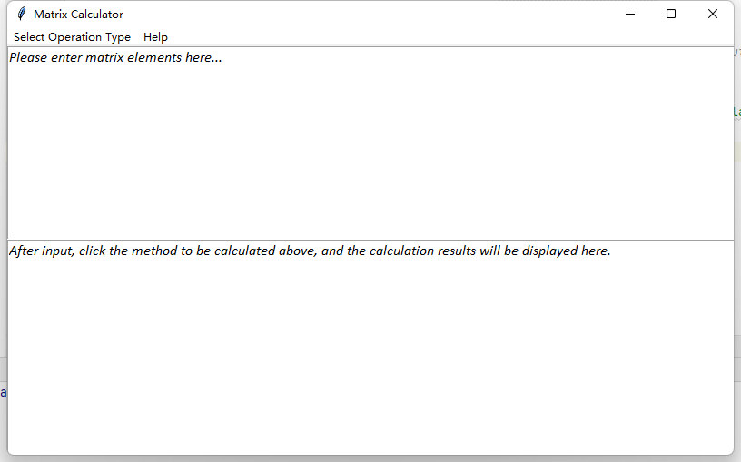
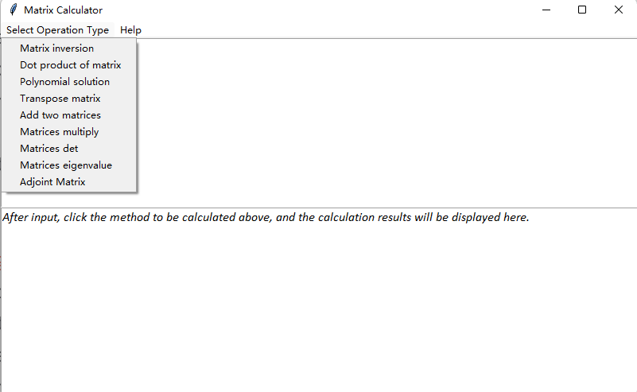

# Product requirement document (PRD)
### Software title
Matrix Calculator

### Background and motivation of this software
Due to the need for a large number of matrix calculations in engineering operations, there are currently no rich matrix calculation tools and graphical operation tools. For this reason, we have developed a matrix operator with rich operation functions, which supports graphical interface operation

### Key functions of the software
+ Matrix inversion
+ Dot product of matrix
+ Polynomial solution
+ Transpose matrix
+ Add two matrices
+ Matrices multiply
+ Matrices det
+ Matrices eigenvalue
+ Adjoint Matrix

### Algorithm/scientific methods behind our software
We use python to realize the relevant knowledge of linear algebra, such as matrix multiplication. We support the simple evaluation of row and column inner products, and also support the Stratesen algorithm to realize matrix multiplication. For example, when calculating the matrix determinant, we calculate the algebraic cofactor and its sum according to the first column.

### Similar products in the market
There is no matrix calculator with graphical interface on the market, and they are usually console.

# User’s Guide
### Environment dependencies
Python >= 3.6
numpy >= 1.0

### Description of all functions
The main interface contains input and output text fields. The upper part of the main interface contains the type selection button "Select Operation Type" for each calculation method and a "Help" button. The former is used to select the corresponding matrix operation type for the output content, and the latter is used to prompt the user to check the help document.

### Usage Method
Help tips for this application:
+ Find the invertible matrix.
Only one matrix needs to be input to find the invertible matrix.
Example input:
[1 2 -3
0 1 2
0 0 1]
Note that the brackets must use the English character [], and the two adjacent numbers of the Chinese character 【】 cannot be separated by a space.
+ To calculate the dot product of a matrix, you need to input two matrices.
 The input method of the matrix is the same as the above, separated by a capital 'x' in the middle.
  Example input:
  [1 2 3
  1 2 3
  1 2 3]
  x
  [1 2 3
  1 2 3
  1 2 3]
+ Find the solution of the multivariate linear equation.
 In this process, only the coefficient of the unknown number is needed (with sign). The equal sign and the plus and minus sign need not be written. If you want to find X+Y=0,3X+2Y=9, enter as follows:
1 1 0
3 2 9
Adjacent numbers are separated by a space. Output format: [9 - 9], that is, X=9, Y=-9. Align the unknown number with the unknown number above.
+ Transpose matrix
Example:
[1 2 3
1 2 3
1 2 3]
+ Add two matrices
Example:
  [1 2 3
  1 2 3
  1 2 3]
  +
  [1 2 3
  1 2 3
  1 2 3]
+ Matrices multiply
Example:
  [1 2 3
  1 2 3
  1 2 3]
  *
  [1 2 3
  1 2 3
  1 2 3]
+ Matrices det
Example:
[1 0 0
1 2 5
1 9 3]
+ Matrices eigenvalue
Example:
[1 -2 1
0 2 -1
1 1 -2]
+ Adjoint Matrix
Example:
[1 -2 1
0 2 -1
1 1 -2]
