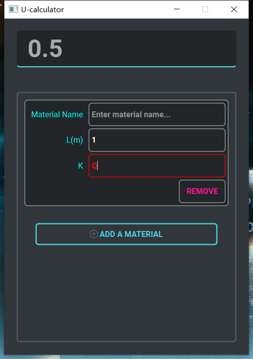
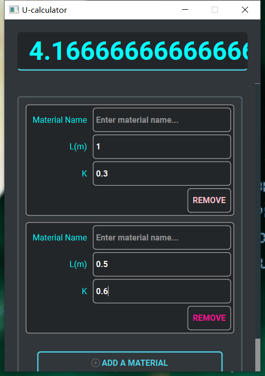
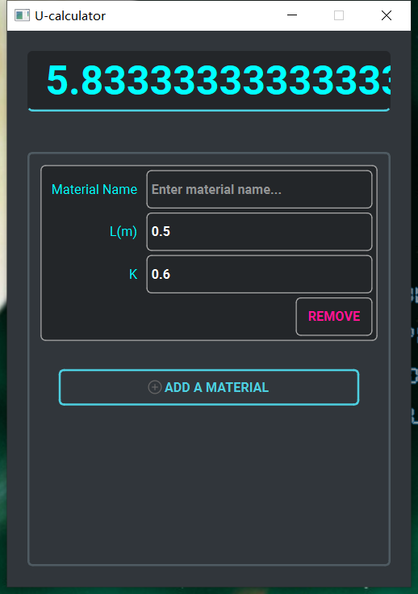

## U-Calculator

## author: shiwei wang
## date: 2023/1/29
#### User Guide

- Run the application *UCalc.exe* is all needed to do. All dependencies are packed.

- 

  The edit bar above show the U value in-time. It's also read-only to prevent unexpected modifying the result U value.

- 

  Click the *ADD A MATERIAL* button to add a new material to calculate. Enter the *L* and *K* value and the result would be calculate automatically.

- 

  A blue U value indicates that the result is valid. If error occurs(e.g. K includes non-digit characters), the U value would be gray. Also, a red border and red character color would make the error more conspicuous.

  

- Click the *REMOVE* button to remove a certain material.

  

  

  The *Material Name* field is actually for user to memorize easily. A blank *Material Name* wouldn't stop the calculator from function normally.
